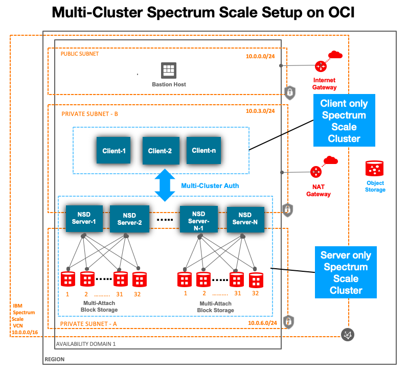
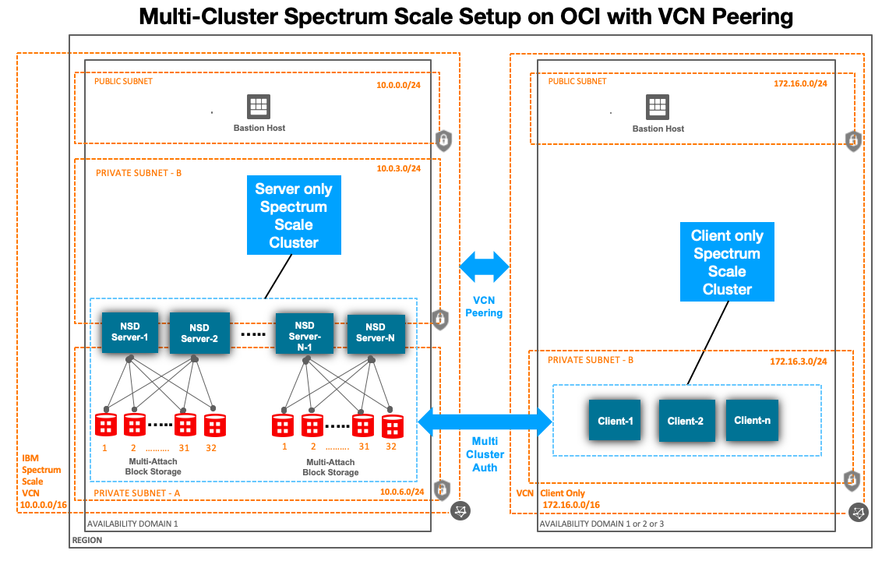

# Spectrum Scale - Clients Only Cluster on OCI
This Terrrafom template deploys a Spectrum Scale clients only cluster.  The clients only cluster will mount a remote Spectrum Scale File System cluster (Storage Cluster) to access data.   Since its very common in HPC world to spin up/spin down a compute cluster, its best to manage client/compute nodes seperately from Spectrum Scale File System cluster (Storage Cluster).  Also there could be multiple client clusters accessing a single Storage cluster.  

**Note:**  This template assumes the Storage Spectrum Scale cluster was already created and this "clients_only_cluster" will not provision any server nodes or storage devices.  For more information on how to create "Storage Spectrum Scale cluster", refer to this link:  [Storage Spectrum Scale cluster](https://github.com/oracle-quickstart/oci-ibm-spectrum-scale/tree/master/network_shared_disk_server_model).


## Client Only Nodes Cluster architecture
Given below are architecture diagram which show both the Client Only Spectrum Scale cluster and Storage cluster, but this template will only provision/deploy the IaaS resources for "clients_only_cluster" and install/configure Spectrum Scale binaries.   


### Multi Cluster Spectrum Scale  


### Multi Cluster Spectrum Scale with VCN Peering



## Prerequisites
First off you'll need to do some pre deploy setup.  That's all detailed [here](https://github.com/oracle/oci-quickstart-prerequisites).


## Clone the Terraform template
Now, you'll want a local copy of this repo.  You can make that with the commands:

    git clone https://github.com/oracle/oci-quickstart-ibm-spectrum-scale.git
    cd oci-quickstart-ibm-spectrum-scale/clients_only_cluster
    ls


## Update variables.tf file
Update the variables.tf to set client compute shapes, # of client nodes, IBM Spectrum Scale binary download URL, version and various other values. 


- Update compute/client **node_count** and **shape** to provision.  A minimum of 3 client nodes are required to maintain quorum in a cluster.  There are ways to overcome this requirement for production, but that's not covered in this deployment template. 

   ```
   Client nodes variables. Min node required is 3 to have quorum.  For production, with some customization, less than 3 nodes can be supported. 
   variable "client_node" {
     type = map(string)
       default = {
         shape      = "VM.Standard2.4"
         node_count = 3
         hostname_prefix = "ss-compute-"
      }
    }
    ```

- Update the **version** and **download_url** variables based on version of Spectrum Scale you plan to deploy.  We recommend you upload the Spectrum Scale binary file to OCI Object Storage bucket (private) and create a pre-authenticated URL to access it from all the spectrum scale nodes to be provisioned by the template.   You can also use any other server to host the binaries, provided the server is reachable over the internet without any authentication (no username/password, etc). 

  - **download_url** : Should be a http/https link which is accessible from all Spectrum Scale instances we will create.  Assuming you have uploaded the spectrum scale software binary to OCI Object storage private bucket. You can create a preauthenticatedrequests using the steps detailed here - [create pre-authenticated url](https://docs.cloud.oracle.com/en-us/iaas/Content/Object/Tasks/usingpreauthenticatedrequests.htm#usingconsole)

  -  **Note:** The name of the spectrum scale software binary file needs to exactly follow this naming convention.  These are the names of the file by default, when you download it from IBM site.
      -  For Spectrum Scale Data Management Edition:  Spectrum_Scale_Data_Management-5.0.3.3-x86_64-Linux-install
      -  For Spectrum Scale Developer Edition:        Spectrum Scale 5.0.4.1 Developer Edition.zip
      -  Once you upload to OCI Object Storage,  the download_url will look like one of the below:
        -  https://objectstorage.us-ashburn-1.oraclecloud.com/xxxxxxxx/Spectrum_Scale_Data_Management-5.0.3.3-x86_64-Linux-install
        -  https://objectstorage.us-ashburn-1.oraclecloud.com/xxxxxxxx/Spectrum%20Scale%205.0.4.1%20Developer%20Edition.zip

  -  **version** : Replace the **version** number with the one you plan to use, eg:  5.0.4.1


- Is the client only cluster going to be deployed in an existing VCN?
  - If no, set **use_existing_vcn** to false, and ignore the **vcn_id, bastion_subnet_id & fs_subnet_id** variable.  The template will create a new VCN using 172.16.0.0/16 CIDR.   Make sure this VCN CIDR does not overlap with VCN CIDR of "Spectrum Scale Storage" cluster.  If it overlaps, then update the **vpc_cidr** variable to use a different non-overlapping CIDR.  

  - If yes,  set the following variables:


    - Set **use_existing_vcn** to true 
    - Set **vcn_id** to existing VCN OCID
    - Set **bastion_subnet_id** to existing public subnet OCID of existing VCN
    - Set **fs_subnet_id** to existing private subnet OCID of an existing VCN based on below conditions. 


      - If the "Spectrum Scale Storage" cluster is also deployed in the same existing VCN, then check 
If Spectrum Scale servers are Baremetal nodes, then this should be the "Private-FS-Subnet" subnet OCID.  If Spectrum Scale servers are VMs or BM.HPC2.36, then this should be the "Private-SpectrumScale" subnet OCID.   Refer to VCN/Subnet details of "Server Spectrum Scale" Cluster. 
fs_subnet_id

      - If the "Spectrum Scale Storage" cluster is **NOT** deployed in the same existing VCN and you plan to use VCN local/remote peering,  then provide a private subnet OCID you plan to use to provision the client/compute nodes.  


## Deployment & Post Deployment

Deploy using standard Terraform commands

        terraform init && terraform plan
        terraform apply 


## Post Deploy Steps 
Once the "clients_only_cluster" is deployed,  there are some post deploy steps to establish authentication between the two clusters and to get the filesystem mounted on client/compute nodes.  

TODO - Steps
