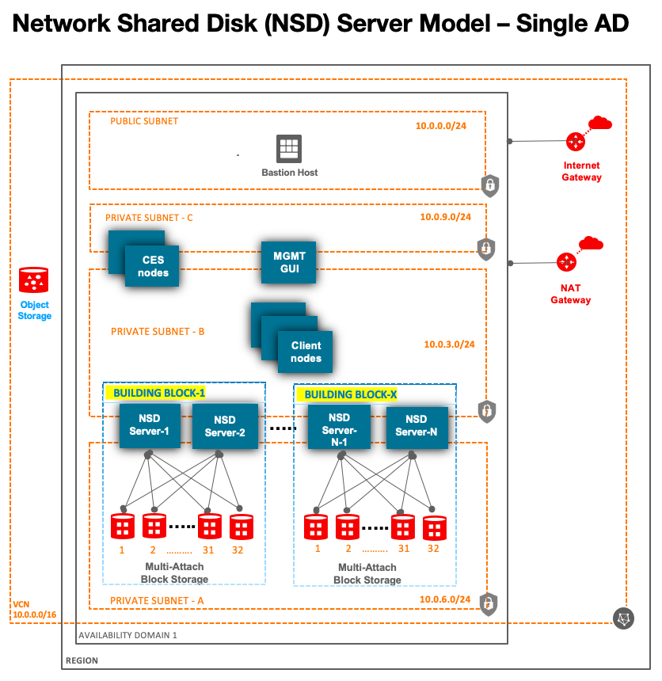

# IBM Spectrum Scale on OCI
This Terrrafom template deploys an IBM Spectrum Scale distributed parallel file system on Oracle Cloud Infrastructure (OCI) using Network Shared Disk (NSD) Server model architecture.

## Network Shared Disk (NSD) Server model architecture
The template creates all the required infrastucture (virtual network, nat gateway, securitylist, compute, Block volume etc.) as well as installs and configures IBM Spectrum Scale Data Management software.  The solution can be deployed across 2 Availability domains (AD) (set DataReplica parameter to 2) or in a single AD. 

### Single AD 

## Multiple AD
We can deploy a stretched cluster across multiple ADs or seperate cluster in each AD and use AFM or other rsync tools to move data.  

## Prerequisites

### 1. IBM Spectrum Scale Software Download  
This template is designed to work with the following editions: 

      Spectrum Scale Data Management Edition
      Spectrum Scale Developer Edition -  Free for upto 12TB Storage 
      Spectrum Scale Data Access Edition

Please download the Free developer edition of Spectrum Scale software binary from [IBM website](https://www.ibm.com/sg-en/marketplace/scale-out-file-and-object-storage/purchase).  The software needs to be stored on a server which is accessible from the file servers created by this template in OCI.  For example: you can save the software in private secure OCI Object Storage bucket and create pre-authenticated request to use in your template.

If you already have license for Spectrum Scale,  then you can download it from [here](https://www.ibm.com/support/fixcentral/swg/selectFixes?parent=Software%20defined%20storage&product=ibm/StorageSoftware/IBM+Spectrum+Scale&release=All&platform=Linux+64-bit,x86_64&function=all)

## Resource Manager Deployment
This Quick Start uses [OCI Resource Manager](https://docs.cloud.oracle.com/iaas/Content/ResourceManager/Concepts/resourcemanager.htm) to make deployment easy, sign up for an [OCI account](https://cloud.oracle.com/en_US/tryit) if you don't have one, and just click the button below:

 

Note, if you use this template to create another repo you'll need to change the link for the button to point at your repo.

## Local Terraform Deployment
First off you'll need to do some pre deploy setup on your local machine to use Terraform with Oracle Cloud Infrastructure.  That's all detailed [here](https://github.com/oracle/oci-quickstart-prerequisites).

## Clone the Terraform template
Now, you'll want a local copy of this repo.  You can make that with the commands:

    git clone https://github.com/oracle/oci-quickstart-ibm-spectrum-scale.git
    cd oci-quickstart-ibm-spectrum-scale/network_shared_disk_server_model
    ls

## Update variables.tf file (optional)
Update the variables.tf to provide the link to Spectrum Scale binary software & its version, change compute shapes to use for NSD servers, dataReplica, # of NSD disks, # of NSD and client nodes and and various other values.  See [OCI Compute shapes](https://docs.cloud.oracle.com/en-us/iaas/Content/Compute/References/computeshapes.htm) for more details. 

| Node Type | Mandatory | Node Shape (Recommended) | Node Count (Production minimum) | Node Shape (Minimum) | Node Count (Minimum) | Comments |
| :---: | :---: | :---: | :---: | :---: | :---: | :---: |
| `NSD server` | Yes | BM.Standard2.52 (Recommended) | 2 | Any Intel OCI Compute shape | 2 | Intel only. Bare metal nodes with 2 physical NIC's are recommended for Production. |
| `CES server` | No | BM.Standard2.52 | 2 | Any Intel OCI Compute shape | 0 | Intel Only.  Use 1 for testing, 2 for prod, but this node is optional. Bare metal nodes with 2 physical NIC's recommended for Production. Use only if access via NFS, SMB, Object access and Transparent Cloud Tiering is required |
| `MGMT GUI server` | No | VM.Standard2.16 or higher | 1 | Any Intel OCI Compute shape | 0 | Intel Only. Add 2, if you want HA for mgmt GUI node |
| `Client server` | Mandatory | Baremetal or VM - Standard or DenseIO. See [OCI Compute shapes](https://docs.cloud.oracle.com/en-us/iaas/Content/Compute/References/computeshapes.htm) | 1 | Any OCI Compute shape | 1 | Throughput received will depend on shape selected. You can have many clients |
| `Bastion server` | Mandatory | VM.Standard2.1 / VM.Standard.E2.1 or higher | 1 | - | 1 | Required |
| `Windows SMB client` | No | VM.Standard2.4 | 1 | VM.Standard2.4 | 0 | You can create a node using the Template,  but by default, its not created. (Optional) |
| `NFS client` | No | Any Compute shape | 1 | - | 0 | For testing, you can use Bastion node as your NFS client |
| `TCT server` | No | Any Compute shape | 1 | - | 0 | Reach out to OCI HPC team or your account representative. |

## Deployment & Post Deployment

Deploy using standard Terraform commands

        terraform init && terraform plan
        terraform apply
        
For large clusters, use the below to ensure deployment does not fail due to API throttle limits

        terraform apply -parallelism=3

## Terraform apply - output 

## Output for various GPFS commands

## Spectrum Scale Management GUI Interface

### Metrics

### Dashboard

### Throughput

