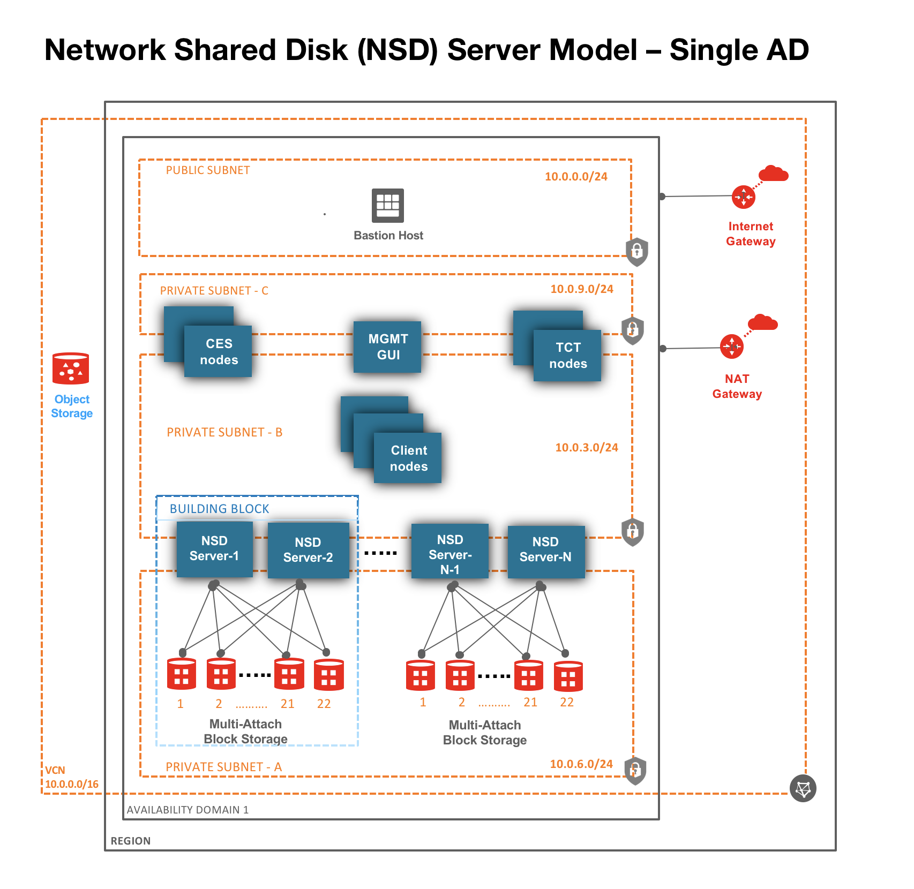
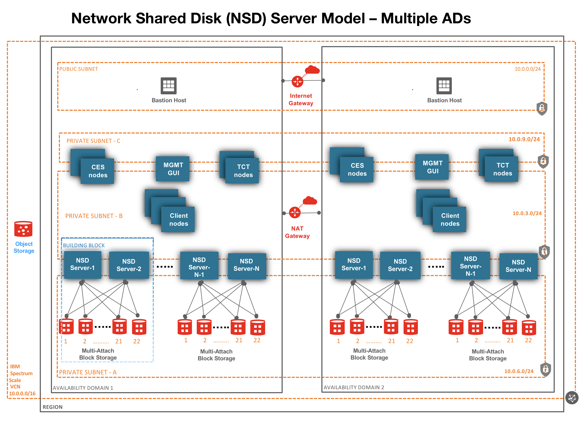

# IBM Spectrum Scale on OCI
This Terrrafom template deploys an IBM Spectrum Scale distributed parallel file system on Oracle Cloud Infrastructure (OCI) using Network Shared Disk (NSD) Server model architecture.

## Network Shared Disk (NSD) Server model architecture
The template creates all the required infrastucture (virtual network, nat gateway, securitylist, compute, Block volume etc.) as well as installs and configures IBM Spectrum Scale Data Management software.  The solution can be deployed across 2 Availability domains (AD) (set DataReplica parameter to 2) or in a single AD. 

### Single AD 

## Multiple AD

## IBM Spectrum Scale Data Management license 
This template assumes you already have purchased a license from IBM and have downloaded the software.  The software needs to be stored on a server which is accessible from the servers created by this template in OCI.  For example: you can save the software in OCI Object Storage bucket and create pre-authenticated request to use in your template.  

## Prerequisites
First off you'll need to do some pre deploy setup.  That's all detailed [here](https://github.com/oracle/oci-quickstart-prerequisites).

## Clone the Terraform template
Now, you'll want a local copy of this repo.  You can make that with the commands:

    git clone https://github.com/oracle/oci-quickstart-ibm-spectrum-scale.git
    cd oci-quickstart-ibm-spectrum-scale/network_shared_disk_server_model
    ls

## Update variables.tf file (optional)
This is optional, but you can update the variables.tf to change compute shapes to use for NSD servers, dataReplica, # of NSD disks, # of NSD and client nodes and and various other values. 

| Node Type | Mandatory | Node Shape (Recommended for max throughput) | Node Count (Production minimum) | Node Shape (Minimum) | Node Count (Minimum) | Comments |
| :---: | :---: | :---: | :---: | :---: | :---: | :---: |
| `NSD server` | Yes | BM.Standard2.52 or BM.Standard.E2.64 | 2 | VM.Standard2.8 | 2 | Bare metal nodes with 2 physical NIC's for Production. |
| `CES server` | No | BM.Standard2.52 or BM.Standard.E2.64 | 2 | - | 0 | Use 1 for testing, 2 for prod, but this node is optional. Bare metal nodes with 2 physical NIC's for Production. Use only if access via NFS, SMB, Object access and Transparent Cloud Tiering is required |
| `MGMT GUI server` | No | VM.Standard2.16 or higher | 1 | VM.Standard2.8 | 0 | Add 2, if you want HA for mgmt GUI node |
| `Client server` | Mandatory | BM.Standard2.52 or BM.Standard.E2.64 or VM.Standard2.24 | 1 | VM.Standard2.8 | 1 | Throughput received will depend on shape selected. You can have many clients |
| `Bastion server` | Mandatory | VM.Standard2.1 / VM.Standard.E2.1 or higher | 1 | - | 1 | Required |
| `Windows SMB client` | No | VM.Standard2.4 | 1 | VM.Standard2.4 | 0 | Template builds one just for testing, optional |
| `NFS client` | No | Use bastion node for testing, so need for seperate node | 1 | - | 0 | Template builds one just for testing, optional |

## Deployment & Post Deployment

Deploy using standard Terraform commands

        terraform init && terraform plan
        terraform apply -parallelism=3

## Terraform apply - output 

## Output for various GPFS commands

## Spectrum Scale Management GUI Interface

### Metrics

### Dashboard

### Throughput

