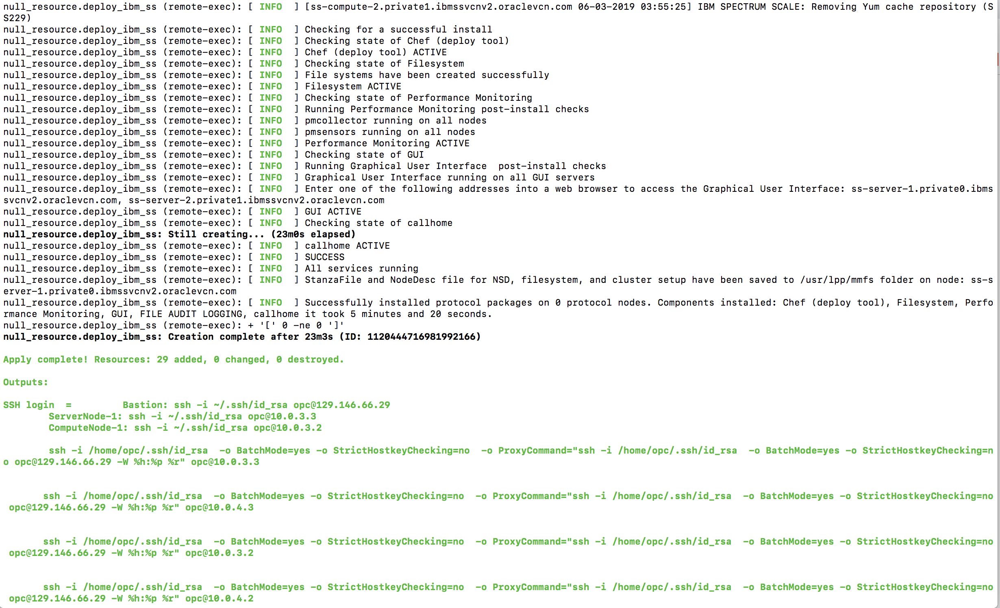
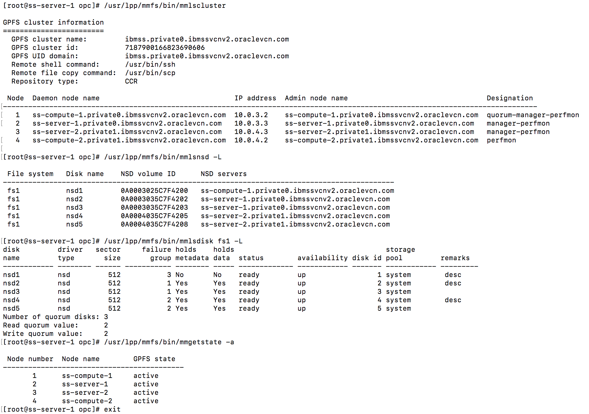

# IBM Spectrum Scale on OCI
This Terrrafom template deploys an IBM Spectrum Scale distributed parallel file system on Oracle Cloud Infrastructure (OCI) using shared disk NSD Server  architecture.

# THIS IS IN PROGRESS 

## IBM Spectrum Scale Data Management license 
This template assumes you already have purchased a license from IBM and have downloaded the software.  The software needs to be stored on a server which is accessible from the servers created by this template in OCI.  For example: you can save the software in OCI Object Storage bucket and create pre-authenticated request to use in your template.  

## Prerequisites
First off you'll need to do some pre deploy setup.  That's all detailed [here](https://github.com/oracle/oci-quickstart-prerequisites).

## Clone the Terraform template
Now, you'll want a local copy of this repo.  You can make that with the commands:

    git clone https://github.com/oci-quickstart/oci-ibm-spectrum-scale.git
    cd oci-ibm-spectrum-scale/shared_disk_nsd_server_model
    ls

## Update variables.tf file (optional)
This is optional, but you can update the variables.tf to change compute shapes to use for servers, dataReplica, # of NSD disks, # of NSD and Compute nodes and and various other values. 

## Deployment & Post Deployment

Deploy using standard Terraform commands

        terraform init && terraform plan && terraform apply

## Terraform apply - output 

## Output for various GPFS commands

